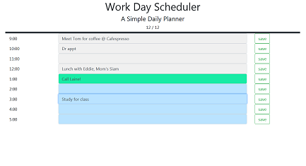

This is a simple app that allows the user to plan out their day by assigning events (meetings, appointments, etc.) to each hour of the work day. By hitting the "save" button, the user places that hour's plan into local storage, making the day planner info persistent on that machine.

See the deployed app here:  https://josi3006.github.io/DayPlanner/

